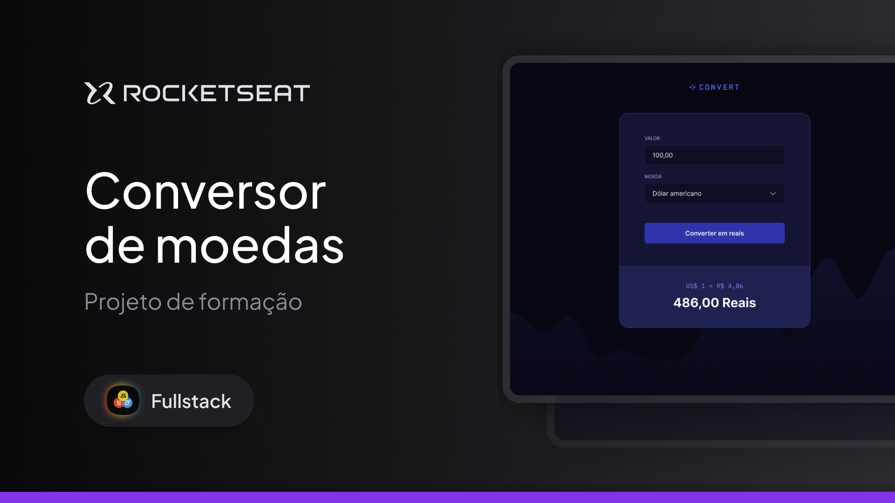
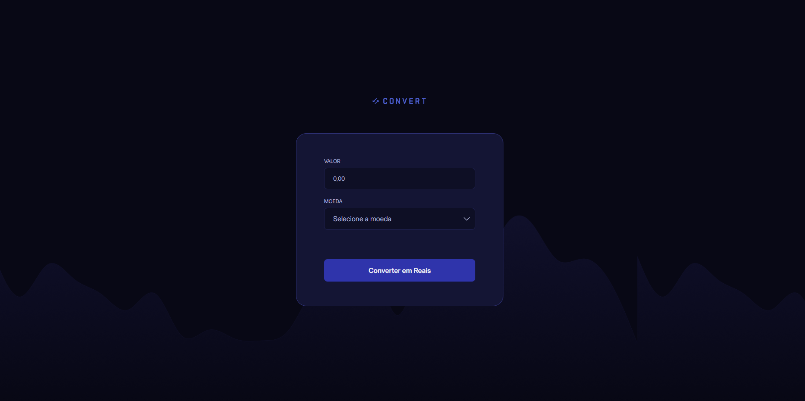

<!-- <p align="center">  
    
</p>

<div align="center">


</div>

## 📖 Sobre

Conversor de moedas estrangeiras (USD/LIB/GBP) para Reais. Encontrei esse projeto da Rocketseat no Figma e inseri algumas funcionalidades.
Consumo de API obtendo o real valor monetário da moeda no dia.
O projeto foi desenvolvido com HTML, CSS e JavaScript.
Funcionalidades interativas que realizam a conversão de valores entre diferentes moedas, com manipulação de DOM e tratamento de eventos.

<p align="center">  
    
</p>

<br/>

## 🎨 Protótipo

Protótipo do projeto foi desenvolvido no Figma e pode ser acessado [aqui](files/prototype.fig) (by [Rocketseat](https://github.com/rocketseat) ❤️).

<br/>

## 🚀 Visualizar o Projeto

O projeto poderá ser visualizado [aqui](currency-converter-jvbtm1sei-rafaelamorimdevs-projects.vercel.app).

<br/>

## 📝 Licença
Esse projeto está sob a licença MIT. Veja o arquivo [LICENSE](LICENSE) para mais detalhes. -->

# 🪙 Currency Converter


Conversor de moedas estrangeiras (dólar, euro e libra) para reais.  
Este projeto foi inspirado em um layout da Rocketseat no Figma, com algumas melhorias e funcionalidades extras.

A aplicação consome uma API em tempo real para obter a cotação atual das moedas, permitindo que o usuário converta valores de forma rápida e precisa.

---

## 🖼 Preview



<br/>


## 💻 Visualizar o Projeto

O projeto poderá ser visualizado [aqui](currency-converter-jvbtm1sei-rafaelamorimdevs-projects.vercel.app).

<br/>
---

## 🚀 Tecnologias

- HTML
- CSS
- JavaScript
- [AwesomeAPI](https://docs.awesomeapi.com.br/api-de-moedas) (cotações em tempo real)

---

## 📦 Funcionalidades

- Conversão de USD, EUR ou GBP para BRL
- Cálculo automático com base no valor digitado
- Resposta com cotação atualizada
- Interação com o DOM e manipulação de eventos
- Estilo responsivo e intuitivo

---

## 📥 Como usar

1. Clone o repositório:
```bash
git clone https://github.com/rafaelamorimdev/currency-converter.git